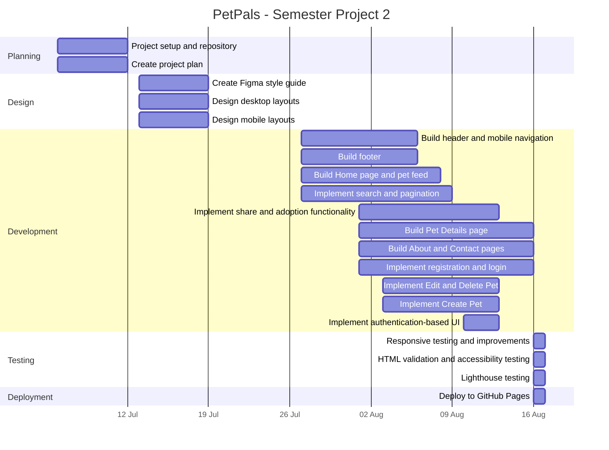

# PetPals Gantt Chart

This Gantt chart provides an overview of the planning, design, development, testing, and deployment phases of the PetPals Semester Project 2.

## Project Phases

The project was divided into four main phases:

- **Planning:** Repository setup and project planning.
- **Design:** Style guide and high-fidelity desktop and mobile designs in Figma.
- **Development:** Implementation of the user interface, API functionality, authentication, pet management, and responsive behaviour.
- **Testing and Deployment:** Responsive testing, HTML validation, accessibility testing, Lighthouse testing, and deployment to GitHub Pages.